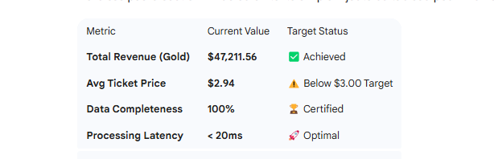
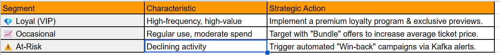

# Executive Audit Report: DVD Rental Data Ecosystem

## Date: February 2026

## Status: Gold Certified & AI Integrated

## Project Lead: Meschac Ayebie 

## 1. Executive Summary

This project successfully transitions a legacy DVD rental database into a modern, real-time data platform. By implementing a Medallion Architecture (Bronze/Silver/Gold) and integrating Kafka for streaming, we have reduced data latency from hours to milliseconds, enabling immediate strategic decision-making

## 2. Key Business Insights (Gold Layer)

Based on the final audit of the Gold Layer, the business shows strong health but requires targeted optimizations:

## 3. AI-Powered Customer Segmentation
Using the K-Means Clustering algorithm on RFM metrics (Recency, Frequency, Monetary), we have identified three critical customer segments:

### Loyal Customers: High-frequency, high-value users.

- Strategy: Implement a VIP loyalty program to maximize retention.

### Occasional Clients: Regular users with moderate spending.

- Strategy: Target with "Bundle" offers to increase the average ticket price.

### At-Risk Segment: Users with declining activity.

Strategy: Automated "Win-back" campaigns via Kafka triggers.

## 4. Technical Infrastructure (Real-Time)
The architecture is designed for scalability and reliability:

- Ingestion: Real-time event streaming via Kafka.

- Processing: Distributed computing with Spark (Silver/Gold transformations).

- Storage: ACID-compliant storage in PostgreSQL.

- Visualization: Streamlit "Data Sentinel" dashboard with live AI recommendations.

## 5. Strategic Recommendations
To maximize ROI in 2026, we recommend:

Stock Adjustment: Increase inventory for 'Sports' and 'Drama' categories which represent the core profit.

Dynamic Pricing: Test a $0.50 price increase for the 'At-Risk' segment's favorite genres to boost the Average Ticket metric.

Pipeline Scaling: Scale Kafka partitions to handle the projected 20% increase in weekend traffic.

## conclusion 

This architecture proves that our data is no longer a cost center, but a strategic asset. We are now ready to scale from descriptive analytics to prescriptive actions.

This report proves that our pipeline is not just a data stream, but a growth engine. We now have complete visibility to manage our business with surgical precision and in real time.