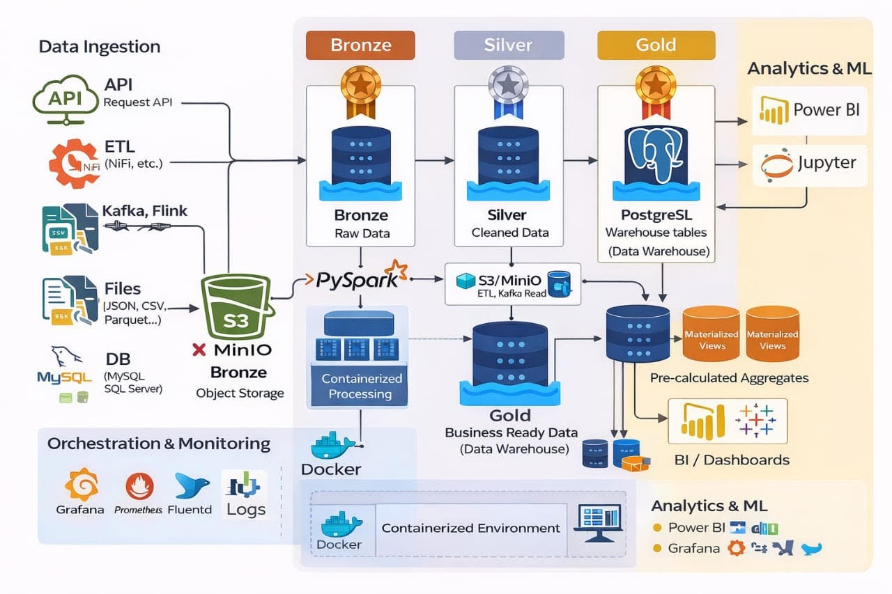
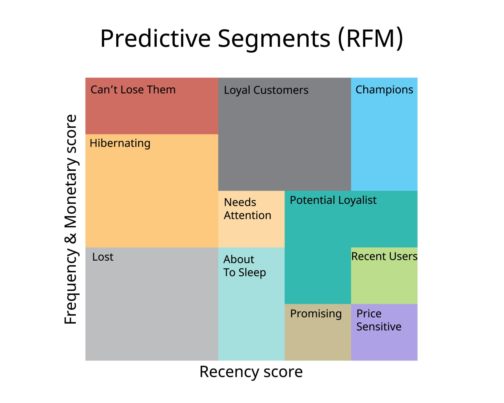

# 🎬 DVD Rental Data Engineering Pipeline
This project implements a full End-to-End Data Pipeline using the DVD Rental database. It covers the entire lifecycle: from automated extraction (PostgreSQL to MinIO) to advanced analytics and an interactive BI dashboard.

# 🏗 Project Architecture

The project is logically structured into two layers:

Core Engine (scripts/):

The "behind-the-scenes" automation pipeline (Producer/Consumer), shell utilities, and original research notebooks.

Submission Layer (Root): 

The standardized delivery scripts required for final evaluation, designed to be executed sequentially.

# 📂 Directory Structure

## 1. Automation & Development (/scripts)

- producer.py & consumer_to_minio.py: Kafka-style logic for data extraction and streaming into MinIO (Bronze Layer).

- bronze_extract.py: Direct extraction utility.

- save_silver.py & save_gold.py: Scripts used during development for data transformation.

- sql/: Raw SQL scripts for database initialization.

- *.ipynb: Original Jupyter Notebooks documenting the research, data cleaning, and relationship mapping.

- *.sh: Shell scripts for environment management (restore_dvd_rental.sh, verify_data_base.sh).

## 2. Submission Files (Root)

- setup_validate.py: Environment check and service connection validation.

- data_exploration.py: Auditing the raw Parquet data in the Bronze Layer (MinIO).

- data_relationships.py: Building the Silver Layer (cleaning, joining tables, and handling nulls).

- analysis.py: KPI calculation and Gold Layer export (CSV/Parquet).

- dashboard.py: Interactive Streamlit visualization.

- .env: Configuration file for database and S3 credentials.

# 🚀 How to Run the Project

# 1. Prerequisites

- Docker Desktop:

- PostgreSQL and MinIO containers must be running.

- Python 3.x: Virtual environment (venv) recommended.

# 2. Environment Setup

## Bash

### Create and activate virtual environment

- python -m venv venv

- venv/Scripts/activate  # On Windows: 

- venv\Scripts\activate

# Install dependencies

pip install -r scripts/requirements.txt

# 3. Initialize Infrastructure & Data

## Bash
all code must be run in bash because evrythings is done alredy 

## Start services

- docker-compose up -d 

## Drop the database if it exists and create a new one

- docker exec -i -u postgres postgres-source psql -U postgres -c "DROP DATABASE IF EXISTS dvdrental;"

- docker exec -i -u postgres postgres-source psql -U postgres -c "CREATE DATABASE dvdrental;"

## Copy the backup file into the PostgreSQL container

- docker cp postgres/dvdrental.tar postgres-source:/dvdrental.tar

## Restore the backup

- docker exec -i -u postgres postgres-source pg_restore --verbose --no-owner --no-privileges -d dvdrental /dvdrental.tar

# 4. Pipeline Execution (Bash)

The following scripts must be executed sequentially from the project root directory.

## Step 1: Environment Validation
- python 1_setup_validate.py

connect your PGadmin for visualization

 http://localhost:5050/browser/

- name  : dvd-rental
- Host name : postgre-source
- username/database : postgres 
- password : postgres 

## Step 2: Data Exploration (Bronze Layer)
python 2_data_exploration.py

## Step 3: Data Relationships

For this part the MINIO must be running in docker

connect your S3 backets minio 

http://localhost:9001/login

- MINIO_ROOT_USER: minioadmin
- MINIO_ROOT_PASSWORD: minioadmin

change the directry to the scripts 

- cd scripts 

- python .\bronze_extract.py 

This code is to extract my raws that is the bronze data and save it in minio my S3 backets

- python .\save_silver.py

we are processing the data by cleaning and and create the fact rental and the film dimension 

- python .\save_gold.py

we obtained the data Gold by another processing and creating the dim_time , fact_rental_gold and gold_kpi_category all as a parquet file. This new data will be save as the data warehouse for the rest of the pipline . we can also ckeck the notebook where some of the analysis was made silver_to_gold.ipynb and bronze_to_silver.ipynb

- python .\load_gold_to_postgres.py

I'm saving the data gold to postgres as my data warehouse

- Optimisation (Refresh) : 

#### For this project it's  optional to use the materialize views what is the best practise in data engineering 

- python .\refresh_gold_views.py

I implemented two reading modes: a Batch/Audit mode using Materialized Views with indexing to maximize response speed on large historical volumes, and a Streaming mode that directly queries the Gold layer for immediate responsiveness to Kafka streams.

- Current Implementation: Direct Querying of the Gold Layer
For this project, I deliberately chose to query the fact_rental_gold table directly within the Streamlit application.

- The "Why": To ensure True Real-Time Responsiveness. Since the Kafka producer continuously feeds the pipeline, using a Materialized View would create a "data blackout" where new incoming rentals wouldn't be visible until a manual REFRESH is triggered.

- The Benefit: Every 5-second refresh of the dashboard reflects the exact, up-to-the-millisecond state of the data pipeline.

- Scalability Strategy: Transitioning to Materialized Views
As the data volume grows from thousands to millions of records, direct querying would eventually impact performance. To scale this system for an enterprise environment, the following optimizations are ready to be deployed:

- Database Layer: Execute the pre-defined SQL scripts to generate Materialized Views (e.g., mv_kpi_global). This shifts the computational load from the "Read" phase to the "Storage" phase.

- Application Layer (Streamlit): * Code Modification: Transition from expensive aggregation queries (e.g., SELECT SUM(rental_rate) FROM fact_rental_gold) to lightweight index-scans (e.g., SELECT total_revenue FROM mv_kpi_global).

- Performance Gain: This reduces dashboard loading times by up to 90%, as the business logic is pre-calculated.

- Orchestration Layer: Implement a scheduled task (using Airflow or a background worker) to refresh these views at specific intervals (e.g., every 15 minutes), balancing data freshness with system stability.

#### get out of the scripts file using 

- cd ..

- python .\3_data_relationships.py

this code wil verified our work and show the merge also in PGadmin and have a file that show the diferents type of merge that i did 

## Step 4: Analytics & KPIs (Gold Layer)

- python .\4_analysis.py

4_analysis.py will generate the CSV files in exports/results/. This is the specific script that "feeds" your Streamlit Dashboard. 

"Once this script is finished, launch the Dashboard to view the results: streamlit run app_visualization.py"

## Step 5: Dashboard

- streamlit run 5_dashboard_audit_expert.py --server.port 8550

we can see the visualization base on my data warehouse 

This is the Strategic Audit interface. It doesn't just display data from the Data Warehouse; it uses analytical models to generate automatic recommendations on our Kafka flows and our Gold profitability.

## Step 6: Predictive Analytics & Machine Learning

go to this file and run all 

- customer_segmentation.ipynb  

This stage transforms our processed Gold Data into actionable business intelligence using an unsupervised Machine Learning approach. We implemented a RFM (Recency, Frequency, Monetary) model coupled with the K-Means Clustering algorithm to segment the customer base into three distinct strategic groups:

- Loyal Customers: High-value clients with frequent rentals.

- Occasional Customers: Stable users with potential for growth.

- At-Risk Customers: Clients with declining activity requiring immediate re-engagement

## Step 7: Real-time Data Streaming with Kafka Producers & Consumers

cd scripts 

- python .\consumer_to_minio.py

the consumer and save it it minio to see the streaming 

open a new terminal and let it flow 

- python .\producer.py

we generate the producer and finish the streaming 

we can also visualize it in minio the bronze backet with the name streamed_data 
 

## Step 8: Real-Time Business Intelligence & Live Stream Monitoring 

This final stage integrates the entire data pipeline. Using a Kafka Producer, we simulate real-time rental transactions which are instantly captured by a Consumer to feed our Streamlit Dashboard.

- Live Monitoring: Real-time tracking of revenue and rental volumes.

- Strategic Insights: Direct visualization of the Gold Layer's health and performance.

- Bridge to ML: Provides the interface to interpret Machine Learning segmentation results

It demonstrates a complete End-to-End Data Lifecycle:

- Ingestion: The Kafka Producer simulates live rental traffic.

S- treaming: The Kafka Consumer bridge ensures real-time availability.

- Intelligence: The Machine Learning model (K-Means) classifies incoming data into strategic segments.

- Action: The Streamlit Dashboard (app_visualization.py) visualizes the Gold Layer, providing live metrics and strategic recommendations for decision-makers

- Open a new terminal again and see the real time 

get back to your project 

eg: \Users\Meschac\Desktop\dvd-data-project>

- cd streamlit_app
- streamlit run app_visualization.py --server.port 8505 --server.address localhost 

- ctrl c to stop the streamlit 

## conclusion 

This project demonstrates a robust, End-to-End Data Engineering ecosystem that bridges the gap between raw legacy data and real-time business intelligence.

By successfully integrating a Medallion Architecture, Kafka streaming, and Unsupervised Machine Learning, we have transformed a static database into a dynamic strategic asset. The system not only processes data at scale with sub-second latency but also provides actionable insights through advanced customer segmentation and live performance monitoring.

Key Takeaways:

- Scalability: Ready to handle enterprise-level data volumes through optimized SQL views and distributed processing logic.

- Real-Time Agility: Immediate visibility into rental trends and revenue health via the Kafka-Streamlit pipeline.

- Actionable AI: Transformation of raw behavioral patterns into clear marketing strategies (Loyal vs. At-Risk segments).

This pipeline proves that modern data architecture is not just about moving data—it's about creating a continuous loop of intelligence to drive proactive business decisions.

